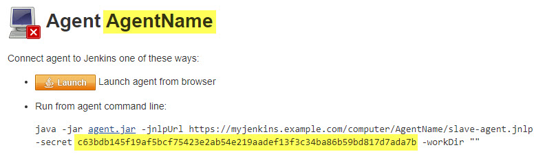

# Launching inbound agents
Jenkins provides a number of ways of connecting remote agents.
Two of the most popular are outbound SSH agents and inbound agents.
SSH agents, most commonly used on Unix platforms, are master initiated.
The master creates the connection when it needs.
Inbound agents, most commonly used on Windows platforms, are agent initiated.
The agent must first connect to the master and then the master sends commands as needed.
These were formerly known as JNLP agents, but that name was erroneous and confusing.
This document describes some of the primary mechanisms for launching inbound agents.

For additional information about Jenkins agents see [Distributed builds](https://wiki.jenkins.io/display/JENKINS/Distributed+builds#Distributedbuilds-HavemasterlaunchagentonWindows).

## Launch mechanisms
Part of the agent status page for inbound agents looks something like this:



This shows a couple of launch methods, but there are other mechanisms.
If you use a different mechanism than clicking the "Launch" button, this page contains parameters that you will need. 
The long string of hex digits is a secret key that the client needs to establish the connection. 
Depending on how you connect you may also need the agent name, "AgentName" in this example, or the (misnamed) jnlpUrl, "https://myjenkins.example.com/computer/AgentName/jenkins-agent.jnlp".

### "Launch" button
This is the only launch mechanism that actually uses JNLP.
When properly configured and supported, clicking this button causes a JNLP file to be downloaded via the web browser and launched with Java WebStart. 

While this is the simplest mechanism it has many drawbacks.
This is an outdated technology that is being phased out.
It requires an interactive user.
If the agent terminates the user will have to click the button again.
This mechanism is not recommended, is deprecated, and may not be supported or available.

### Download JNLP file
Another mechanism, shown in the above status page fragment, runs the agent from a script or command-line to retrieve the JNLP file. 
This mechanism does not use JNLP or WebStart but uses the downloaded file to obtain connection information. 

For an inbound agent using the TCP port, this is a two-step process:
* Connect to an HTTP(S) port to retrieve the connection information.
* Extract that information and connect to the TCP port.

(When using the `-webSocket` option, only a single connection needs to be made.)

Before invoking this command you must download the "agent.jar" file.
The correct version can be obtained from your Jenkins server at something like "https://myjenkins.example.com/jnlpJars/agent.jar".
These operations can be combined in a script, cron job, or service.

A typical example of this command, as shown in the above image, is
``` 
java -jar agent.jar \
  -jnlpUrl <jnlp url> \
  -secret <secret key> \
  -workDir <work directory> 
```

### Connect directly to TCP port
With the latest versions of the Remoting library (since 3.34), it is possible to connect directly to the TCP port. 
This skips the download of the connection information file, described in step 1) above. 
To use this you must provide some of the information that the downloaded file would contain.

You must provide the agent name. 
This is easily obtained from the agent status page or other places.

You need to specify the host and port, in a typical `HOST:PORT` fashion. 
The HOST can be whatever name or address resolves to the server. 
The PORT value can be determined by examining the JNLP file or looking at the Agents section of the server Configure Global Security page.

Each Jenkins instance has its own [Instance Identity](https://wiki.jenkins.io/display/JENKINS/Instance+Identity). 
The agent needs this key to complete the connection. 
You can obtain this value via the script console or the Instance Identity page.

Using the script console, execute the command
```
hudson.remoting.Base64.encode(org.jenkinsci.main.modules.instance_identity.InstanceIdentity.get().getPublic().getEncoded())
```
Capture the result to pass into the agent invocation.

You can also capture the value by visiting the Instance Identity page, at something like "https://myjenkins.example.com/instance-identity". 
If you use this mechanism you must stitch it back together into a single, complete value from its multi-line display representation.

This mechanism requires a download of the `agent.jar`, as described for "Download JNLP file".

Once all the prerequisite files and data have been obtained, the agent can be launched with a command like this
```
java -cp agent.jar hudson.remoting.jnlp.Main \
  -headless \
  -workDir <work directory> \
  -direct <HOST:PORT> \
  -protocols JNLP4-connect \
  -instanceIdentity <instance identity> \
  <secretString> <agentName>
```
The "-protocols" parameter is optional, but is useful to limit the agent to protocols the server supports. 
The only currently supported and recommended protocol is "JNLP4-connect".

Note that this mechanism uses a different JAR entry point than used for "Download JNLP file". 
The parameters available and the default behavior may be different between the entry points.

### Install as Windows service
On a Microsoft Windows platform, you can install the agent as a Windows Service.
This allows the Windows Service infrastructure to manage the process lifecycle.

To configure the agent this way, first launch the agent using one of the other mechanisms that doesn't run as headless. 
In the agent GUI, select "File -> Install as a service". 
Additional descriptions of configuring this mechanism are located at [Installing Jenkins as a Windows service](https://wiki.jenkins.io/display/JENKINS/Installing+Jenkins+as+a+Windows+service) or [How to Install Several Windows Agents as a Service?](https://support.cloudbees.com/hc/en-us/articles/217423827-How-to-Install-Several-Windows-Slaves-as-a-Service-)

## Parameters

There are a number of different launch parameters that control how the agent connects and behaves. 
The parameters available and the default behavior may vary depending upon the entry point. 
You can obtain usage information by executing `java -cp agent.jar hudson.remoting.jnlp.Main` or `java -jar agent.jar --help`. 
Not all parameters work together and some parameters require the use of others.

There are also system or environment variables that control some advanced behaviors documented at [Remoting Configuration](https://github.com/jenkinsci/remoting/blob/master/docs/configuration.md). 
Many of these need to be set at both master and agent. 
Changing some of these may result in unreliable behavior. 
One of these parameters that is supported with defined behavior is [`NO_PROXY`](https://github.com/jenkinsci/remoting/blob/master/docs/no_proxy.md). 
Similar to the usage in a number of other applications, this controls which hosts should be excluded from proxy configurations.

### The '@' argument annotation

If any command-line argument is prepended with the '@' symbol, special behavior is invoked. 
For example, more recent versions of Jenkins show in the UI that one form of launching inbound agents is
```
echo <secret key> > secret-file
java -jar agent.jar -jnlpUrl <jnlp url> -secret @secret-file -workDir <work directory> 
```
This varies from the form shown above in "Download JNLP file" in that the secret key is stored in a file rather than passed directly in the command-line. 

The behavior is more general than shown on the agent status page. 
Any argument passed to the program (not interpreted by Java) may start with an '@'. 
The agent will interpret the rest of that argument as the name of a file, "secret-file" in this example. 
The agent reads this file and augments the command-line with an argument for each line in the file.

As an expanded example, you could incorporate this line in common agent management scripts
```
java -jar agent.jar \
  @agent_options.cfg
```
with an "agent_options.cfg" file for each agent looking something like this
```
-jnlpUrl
<jnlp url>
-secret
<secret key>
-workDir <work directory>
```
This could be a good way of extracting out the agent configuration information.
