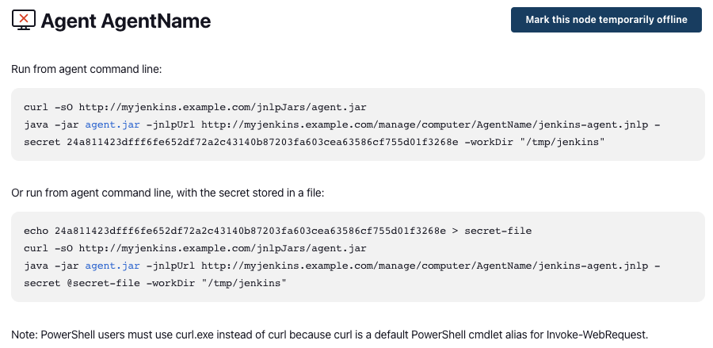

# Launching inbound agents

Jenkins provides a number of ways of connecting remote agents.
Two of the most popular are outbound SSH agents and inbound agents.
SSH agents, most commonly used on Unix platforms, are controller initiated.
The controller creates the connection when it needs.
Inbound agents, most commonly used on Windows platforms, are agent initiated.
The agent must first connect to the controller and then the controller sends commands as needed.
These were formerly known as JNLP agents, but that name was erroneous and confusing.
This document describes some of the primary mechanisms for launching inbound agents.

For additional information about Jenkins agents see [Distributed builds](https://wiki.jenkins.io/display/JENKINS/Distributed+builds#Distributedbuilds-HavemasterlaunchagentonWindows).

## Launch mechanisms

Part of the agent status page for inbound agents looks something like this:



This page contains parameters that you will need to launch an agent.
These include the Jenkins URl and the agent name (`agentName` in this example).
The long string of hex digits is a secret key that the client needs to establish the connection. 
This key is based on the agent name and a per-controller secret.

Note that the secret key will always be the same for a given agent name on the same Jenkins controller.
If the secret key of an agent is compromised, do not reuse the agent name on the affected Jenkins controller.

### "Launch" button

Historically there was a launch mechanism based on Java Web Start/JNLP (`javaws`).
This has been removed.

### Run from command line

The recommended launch mechanism is to run the agent from the command line or a script.
This mechanism does not use JNLP or Java Web Start.

For an inbound agent using the TCP port, this is a two-step process:

* Connect to an HTTP(S) port to retrieve the connection information.
* Extract that information and connect to the TCP port.

(When using the `-webSocket` option, only a single connection needs to be made.)

Before invoking this command you must download the `agent.jar` file.
The correct version can be obtained from your Jenkins controller at e.g. `https://jenkins.example.com/jnlpJars/agent.jar`.
These operations can be combined in a script, cron job, or service.

A typical invocation of this command, as shown in the above image, is as follows:

```bash
$ java -jar agent.jar \
  -url <jenkins url> \
  -secret <secret key> \
  -name <agent name> \
  -workDir <work directory>
```

The most commonly used option is `-webSocket`. Run `java -jar agent.jar -help` for more.

### Connect directly to TCP port

With recent versions of the Remoting library (since 3.34), it is possible to connect directly to the TCP port. 
This skips the download of the connection information file, described in step 1) above. 
To use this you must provide some of the information that the downloaded file would contain.

You need to specify the host and port, in typical `HOST:PORT` fashion, as the argument to `-direct`.
The `HOST` can be whatever name or address resolves to the controller.
The `PORT` value can be determined by looking at the **Agents** section of the controller's **Configure Global Security** page.

Each Jenkins controller has its own [Instance Identity](https://wiki.jenkins.io/display/JENKINS/Instance+Identity). 
The agent needs this key to complete the connection. 
You can obtain this value via the script console or the Instance Identity page.

Using the script console, execute the following statement:

```groovy
hudson.remoting.Base64.encode(org.jenkinsci.main.modules.instance_identity.InstanceIdentity.get().getPublic().getEncoded())
```

Capture the result to pass into the agent invocation.

You can also capture the value by visiting the Instance Identity page at e.g. `https://jenkins.example.com/instance-identity`.
If you use this mechanism you must stitch it back together into a single, complete value from its multi-line display representation.

This mechanism requires a download of the `agent.jar` file, as described above in **Run from command line**.
Similarly, you must provide the secret and agent name.

Once all the prerequisite files and data have been obtained, the agent can be launched as follows:

```bash
$ java -jar agent.jar \
  -direct <HOST:PORT> \
  -instanceIdentity <instance identity> \
  -protocols JNLP4-connect \
  -secret <secret key> \
  -name <agent name> \
  -workDir <work directory>
```

The `-protocols` parameter is optional, but it is useful to limit the agent to protocols the controller supports.
The only currently supported and recommended protocol is `JNLP4-connect`.

### Install as Windows service
On a Microsoft Windows platform, you can install the agent as a Windows Service.
This allows the Windows Service infrastructure to manage the process lifecycle.

GUI-based service installation has been removed. You can still use the Windows service wrapper.
Additional descriptions of configuring this mechanism are located at [Installing Jenkins as a Windows service](https://wiki.jenkins.io/display/JENKINS/Installing+Jenkins+as+a+Windows+service) or [How to Install Several Windows Agents as a Service?](https://support.cloudbees.com/hc/en-us/articles/217423827-How-to-Install-Several-Windows-Slaves-as-a-Service-)

## Parameters

There are a number of different launch parameters that control how the agent connects and behaves. 
You can obtain usage information by executing `java -jar agent.jar -help`.
Not all parameters work together and some parameters require the use of others.

There are also system or environment variables that control some advanced behaviors documented at [Remoting Configuration](https://github.com/jenkinsci/remoting/blob/master/docs/configuration.md). 
Many of these need to be set at both controller and agent. 
Changing some of these may result in unreliable behavior. 
One of these parameters that is supported with defined behavior is [`NO_PROXY`](https://github.com/jenkinsci/remoting/blob/master/docs/no_proxy.md). 
Similar to the usage in a number of other applications, this controls which hosts should be excluded from proxy configurations.

### The '@' argument annotation

If any command-line argument is prepended with the '@' symbol, the argument is read from a file of that name.
For example, recent versions of Jenkins show that one form of launching inbound agents is:

```bash
$ echo <secret key> > secret-file
$ java -jar agent.jar -url <jenkins url> -secret @secret-file -name <agent name> -workDir <work directory>
```

This varies from the form shown above in **Run from command line** in that the secret key is stored in a file rather than passed directly on the command line.
