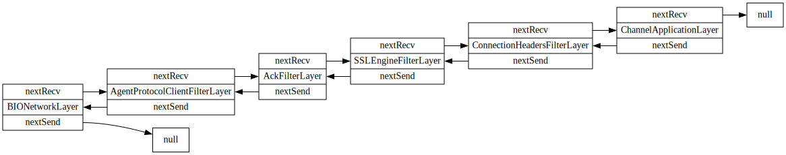

Remoting protocols
====

The Remoting library provides APIs which allow custom communication protocols to be implemented.

This section describes only the protocols available within the remoting library.

## Active protocols

This section lists all actively maintained protocols offered in Remoting.
There may be other actively maintained protocols in other Jenkins and 3rd-party components.

### JNLP4-connect

* Introduced in: Remoting 3.0, [JENKINS-36871](https://issues.jenkins-ci.org/browse/JENKINS-36871)

This protocol uses the <code>SSLEngine</code> provided by the Java Cryptography Architecture 
  to perform a TLS upgrade of the plaintext connection before any connection secrets are exchanged. 
The subsequent connection is then secured using TLS. 

The encryption algorithms and cyphers used by the <code>SSLEngine</code> when using Oracle JDK 1.8 
   are described in [Java Cryptography Architecture Standard Algorithm Name Documentation for JDK 8](http://docs.oracle.com/javase/8/docs/technotes/guides/security/StandardNames.html))
If stronger algorithms are needed (for example, AES with 256-bit keys), the [JCE Unlimited Strength Jurisdiction Policy Files](http://www.oracle.com/technetwork/java/javase/downloads/index.html)
  can be obtained on Oracle website and installed in the JDK/JRE.

Protocol uses non-blocking I/O wherever possible which removes the performance bottleneck of the <code>JNLP3-connect</code> protocol.

The protocol stack starts with the network layer, proceeds to an arbitrary number of filter layers, and ends with the application layer.
It is represented as a doubly-linked list:

### WebSocket

* Introduced in: Remoting version 4.0, [JEP-222](https://jenkins.io/jep/222)
* At initial release, this protocol is considered a beta release and has not yet undergone extensive testing.

Uses WebSocket over an HTTP(S) port to handle handshakes, encryption, framing, etc.

## Plugin protocols

### Remoting Kafka Plugin

* [Remoting Kafka Plugin](https://github.com/jenkinsci/remoting-kafka-plugin) uses Kafka as fault-tolerant communication layer to support command invocation between Jenkins controller and agent.
* The plugin gets rid of current direct TCP connection between controller and agent.
* More info can be found in the technical [documentation](https://github.com/jenkinsci/remoting-kafka-plugin/blob/master/docs/DOCUMENTATION.md) of the plugin.
